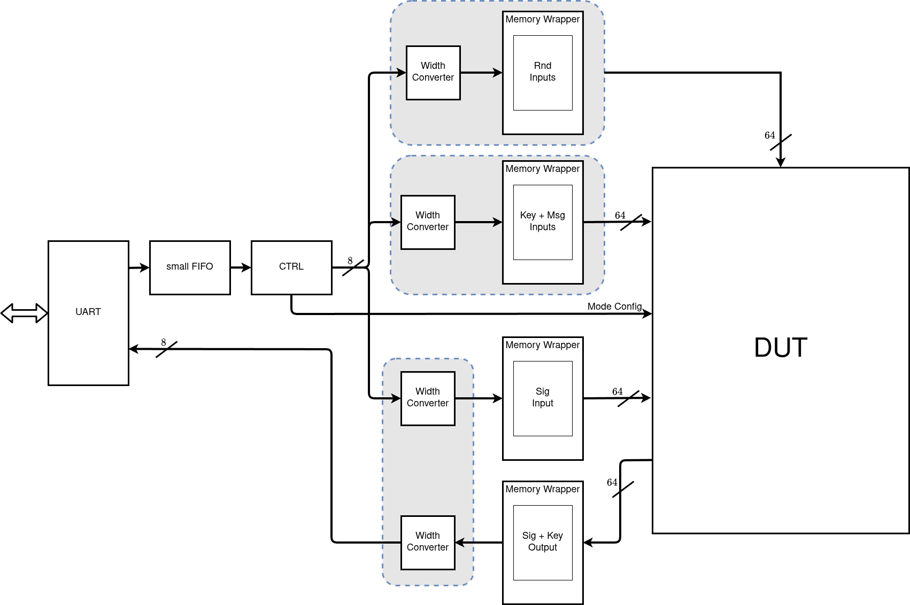
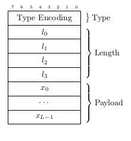

# FPGA Validation and Benchmarking

This directory provides utilities to run the design on a Digilent Nexys Video board communicating via the UART/FTDI connector.
For simplicity, the bitstreams are created with a target frequency of 50 MHz and signature generation signs a random 16-byte message.

## Requirements

The scripts require Vivado for bitstream generation and OpenOCD to flash the board.
Furthermore, please provide an openocd configuration file for the Digilent Nexys Video board (can also be downloaded [here](https://github.com/openocd-org/openocd/blob/master/tcl/board/digilent_nexys_video.cfg)) and save it in this directory.

## Generating the bitstreams
To generate all 18 bitstreams for the corresponding parameter sets:

```console
$ python3 generate_bitstreams.py
```

The bitstreams will be written to the `bitstreams` directory.

## Running the tests
To flash the bitstreams and run the tests:

```console
$ python3 run_nexys.py
```

This will automatically load the generated bitstreams, execute (by default) 100 keygen, sign and verify runs and store the corresponding
cycle counts in a `.csv` in the `cc_results` subdirectory.
The default UART baudrate 2,000,000 - changes also require configurations in the VHDL test harness.
By default, the UART communicates via `ttyUSB0`, but this might have to be changed in `run_nexys.py` (line 78) depending on your setup.

### Changing the baudrate
- Change in [`run_nexys.py`](run_nexys.py) line 79
- Change in [`../fusesoc/test/rtl/framework_pkg.vhd`](../fusesoc/test/rtl/framework_pkg.vhd) line 37


## Test harness overview


The test harness consists of a simple UART interface, a control unit (CTRL) which decodes packets received from the host device, and some buffers around the DUT to store all inputs and outputs.
The idea is that the host device sends the input of the selected operation to the DUT, configures the mode of operation and triggers execution.
The DUT then performs the operation and the result can be read back over UART.

The sections below descripe the working concept of the test harness.
For details, also have a look at [`dut_nexys.py`](./dut_nexys.py)

### Paket structure
Data sent to the DUT is encoded in packets of length $L$ bytes.
To indicate into which memory/fifo the data is being sent, we use a packet structure as shown below.



Each data packet consists of an 8-bit type encoding, 32-bit length field sent over 4 bytes $l_i$, where the lsb is sent first, and the $L$ byte payload.
The actual encodings are listed below.

### Type encodings

| Packet Type 	| Byte Encoding |
|---			|---			|
| RND 			| 0x00 			|
| KEYs + MSG	| 0x01 			|
| SIGNATURE		| 0x02 			|
| CTRL 			| 0x03 			|

### Operation encodings

Keygen, sign and verify is configured by the control vector.
This vector has 3-bits, the first two of which encode the requested operation as shown in the table below, and the third bit that triggers execution and is automatically cleared when acknowledged by the DUT.

| Packet Type 	| Byte Encoding |
|---			|---			|
| KEYGEN		| 0x00 			|
| SIGN			| 0x01 			|
| VERIFY		| 0x02 			|
